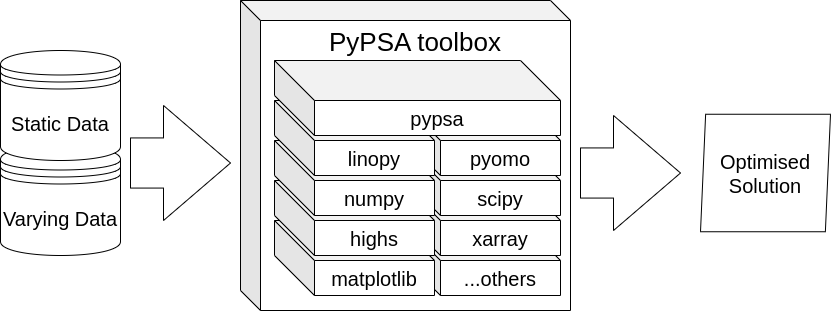

# Modeling Integrated Power Markets

This repository supports the modeling activities for the Modeling Integrated Power Markets course.

In this course, we use Python for Power System Analysis (PyPSA)—an open-source toolbox designed for simulating and analyzing energy systems. While PyPSA provides a flexible and transparent framework, it does not fully replicate the complexities of actual power markets. In some cases, simplifying assumptions are made to approximate market behavior.

The primary goal of the modeling activities is to illustrate how different actors interact within a power market environment.

A typical PyPSA network consists of two key data types:

* Static data: Describes the physical and structural components of the energy system, such as network topology, generation assets, and load configurations.
* Time-varying data: Includes time series representing variables like electricity demand, renewable generation availability, and market prices.

A workflow is used to import data, solve the network and view the results. 

For this course, delegates will interact with the model using Google Colab. 

Google Colab (short for Colaboratory) is a free cloud-based platform provided by Google that lets you:

* Write and run Python code in a Jupyter Notebook environment
* Use powerful GPUs and TPUs for free
* Share code and collaborate like you would with Google Docs
* Install and use Python packages dynamically
* Access files in Google Drive directly
* Run machine learning, data analysis, and modeling workflows with zero local setup

We will link Google Colab to Google Drive so users can keep their models after the course

Follow these steps 

1. Go to https://colab.research.google.com/
2. Click on the Github tab. 
3. Search for PriyeshGosai
4. Find the repository ich-modeling-2025
5. Open the file `RepoSetupGoogleColab.ipynb`
6. In the notebook click Runtime -> Run All. 

Accept the notifications. 

Now open the test notebook: 

1. Go to drive.google.com 
2. In the MyDrive Folder you will find a folder named `ich-modeling-2025`
3. In this folder open the file `introduction-lesson.ipynb`
4. In the notebook click Runtime -> Run All. 
